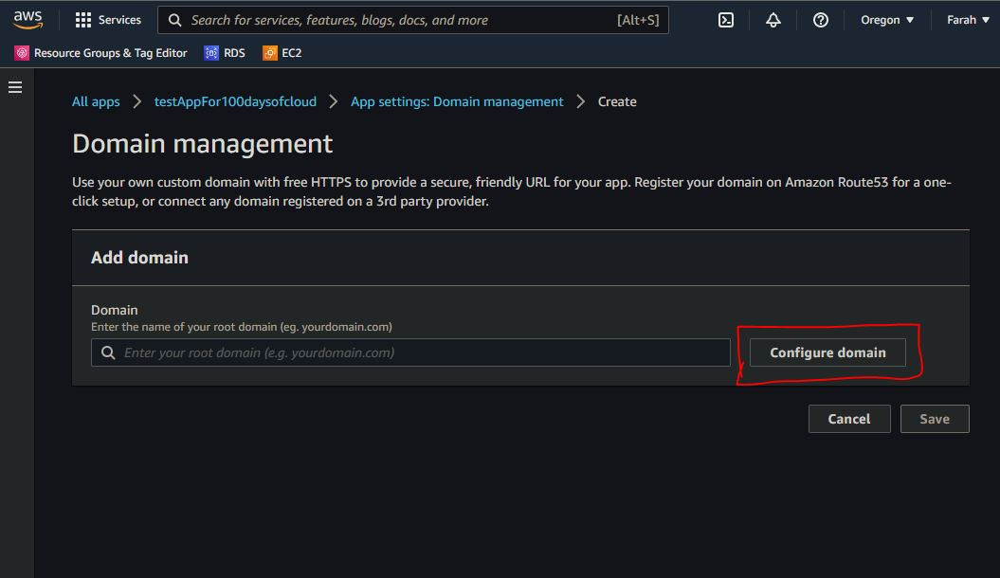
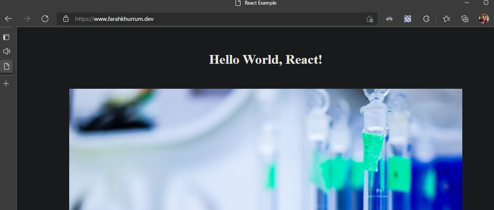

# Setting up SSL and custom domain for the App 

## Introduction
The target for this day is to set up SSL cert, add custom domain and map it to the App deployed in AWS.

## Prerequisite
React app is deployed in AWS and is ready to be connected to a custom Domain name. A Domain name is already registered. 

## Use Case

- Undertanding different options to generate SSL cert and connect the domain name mapping to the app 

## Try yourself

### Step 1 — Add the custom domain name to AWS Amplify app

### Step 2 — Setting up DNS setting in Namecheap for SSL

- [DNS setting Docs followed](https://docs.aws.amazon.com/amplify/latest/userguide/to-add-a-custom-domain-managed-by-godaddy.html) 
**Did this step offline**

### Step 3 - Validate the custom domain is pointing to the deployed app

## ☁️ Cloud Outcome
Able to set up SSL cert and DNS mapping for the custom domain in a 3rd party domain name provider and connecting domain name to AWS Amplify app.

## Next Steps
Add API Gateway and Lambda functions

## Social Proof

Working sample app - https://www.farahkhurrum.dev/

- [Twitch Tutorial Link](https://www.twitch.tv/videos/1248553853) 

