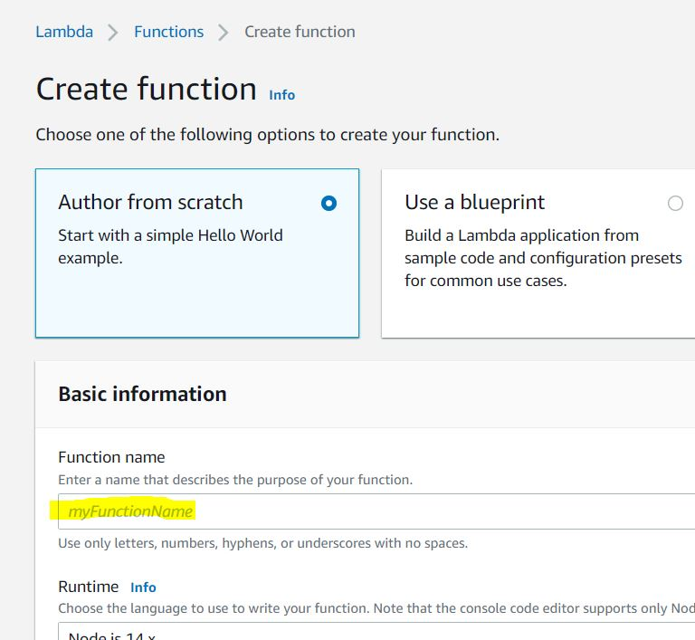

# AWS API Gateway  and Lambda Function

## Introduction

Deploy Lambda Functions and connece to the API Gateway in AWS and validate it is working end to end. 

## Prerequisite

Have some basic understanding of RESTful APIs and how the functions works

## Cloud Research

- Searched the AWS Api Gateway and Lamda Documentation
    - https://docs.aws.amazon.com/lambda/latest/dg/nodejs-handler.html
    - https://docs.aws.amazon.com/apigateway/latest/developerguide/getting-started.html
- AWS Gateway setup and deployment from the UX is not very clear in the documentation. Had to go through trtial and error and guess work to figure out how to deploy the APIs.

## Try yourself

### Step 1 — Create Lambda function

### Step 2 — Add a trigger

### Step 3 — Create the methods for the API and add response 

### Step 4 - Deploy the API methods

### Step 5 - Test the API and Lambda function. 
- 
- 

## ☁️ Cloud Outcome

Was able to create Lambda function, connect it with AWS API Gateway, and successfully trigger it for happy path. 

## Next Steps

Add Dynamo DB and connect Lamda function to add logs from API calls to Dynamo DB and read logs to return as a response. 

## Social Proof
[Twitch Stream link](https://www.twitch.tv/videos/1253433094)

